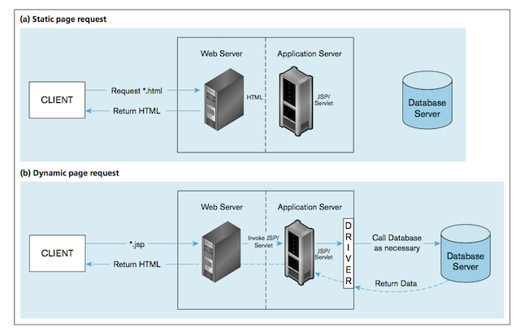
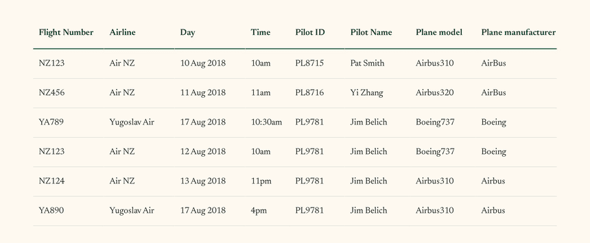

<!-- _class: title -->

# Welcome to MBUA 512

MBUA 512 — Data, Analytics and Insights

---

<!-- _class: callout -->

Databases and analytics knowledge<br>for business analysts to function effectively.

---

# What this course is

The **databases** half covers relational databases, relational modelling, and
SQL queries on an enterprise database. The **analytics** half covers data
extraction, visualisation, and predictive analytics.

_Michael Winikoff and Bogdan State. Based on slides by Professor Markus Luczak-Roesch._

---

# Today

1. Introductions
2. How does MBUA 512 work?
3. Generative AI use
4. What is data — and why does it matter to BAs?
5. Database concepts
6. Introduction to the platform

*Items 4–6 include a group activity.*

---

# Introductions — who are we?

1. Professor **Michael Winikoff** — michael.winikoff@vuw.ac.nz
2. Dr **Bogdan State** — bogdan.state@vuw.ac.nz

---

<!-- _class: section -->

# How does MBUA 512 work?

---

# Learning objectives

Students who pass this course will be able to:

1. Understand the key concepts in database management
2. Design and implement an effective database
3. Write and explain effective database queries
4. Apply and explain the use of analytics in solving business problems
5. Interpret analytics results for decision making

---

<!-- _class: callout -->

This is technical — but designed *not* to assume prior knowledge.<br>You can do this.

---

# Classes — two parts, from next week

- **Part 1:** 12:40–1:30pm Fridays, GBLT1 — whole class (recorded, and on Zoom)
- **Part 2:** 1:40–4:30pm — three streams (activities, not recorded)

Allocation to streams: please complete the survey **by Tuesday 5pm** (see the
Nuku announcement).

---

# Assessments

Each half of the course has **two small assignments** (10% each) and a **large
assignment** (30%).

- Small assignments — develop skills and get feedback
- Large assignments — demonstrate learning

_See Nuku for details and deadlines._

---

# Assessment policies

- **All deadlines are hard** — but extensions are possible if you're affected by
  circumstances outside your control; contact me as soon as possible
- Late penalty: 7% for each (part) day, up to 5 days
- Generative AI — see the next slides

---

<!-- _class: section -->

# Generative AI use

---

<!-- _class: callout -->

Don't use it in a way that will affect your learning.

---

Generative AI is an **amplifier**: you need a basic understanding to guide its
use and evaluate its outputs.

Three key principles:

1. Assistive use only, not a shortcut
2. Full transparency
3. Own your work

--- 

# AI on small assignments

- We **prohibit** any use of generative AI on these
- They are small, easy tasks that require learning the basic concepts
- It's too easy to over-rely on AI in a way that affects your learning — which
  would affect your ability to complete the large assignment
- Clear signs of GenAI use will receive a mark of <span class="accent">0</span>

--- 

# AI on large assignments

- You are **encouraged** to use GenAI, consistent with the key principles
- To check you haven't over-relied on it, each large assignment has a
  closed-book test on paper
- The test covers **basic** knowledge and is designed to be easy
- The test mark doesn't count — but if you don't pass it, you'll meet one of us
  to explain your work. Failing to explain your work results in a mark of 0

--- 

<!-- _class: quote -->

> Questions?

--- 

<!-- _class: section -->

# What is data?

---

# What is data?

A collection of *facts* — numbers, words, measurements, observations,
descriptions.


<p class="credit">DIKW Pyramid by Longlivetheux, CC BY-SA 4.0, via Wikimedia Commons</p>

---

# Activity — data in organisations (10 minutes)

Pick one of the organisations below, form small groups (2–4 people), and answer:

1. What sorts of data would the organisation have?
2. What would happen if access to the data was lost?

**Organisations:** the tax office (IRD), a large store (e.g. The Warehouse), VUW,
a local café.


---

# Types of data

- Qualitative / categorical
- Quantitative / numerical — discrete (e.g. 5) vs. continuous (e.g. 5.2378)
- Structured
- Unstructured

--- 

# Structured data

- Organised into tables or predefined formats
- Examples: bank transactions, contact lists, a calendar

---

# Unstructured data

- No predefined structure
- Examples: photos, video, text messages, social media posts

---

# Structured vs. unstructured

- The type of the data affects what you can do with it, and how
- Structured data is easier to analyse for insight
- Unstructured data can be richer
- Some data is both — photos and audio carry metadata


---

# Activity — types of data in organisations (10 minutes)

Staying with the organisation you chose earlier, in your groups answer:

- What *structured* data might the organisation have?
- What *unstructured* data might it have?
- What insights might it extract from each?

**Organisations:** the tax office (IRD), a large store (e.g. The Warehouse), VUW,
a local café.


--- 

# Key takeaways — what is data

- Structured — orderly, fast to draw insight from
- Unstructured — messy, but meaningful

> Both are valuable.

---

# Why does data matter to BAs?

- Information systems include data as an essential component
- Business analysts elicit and capture the requirements that relate to data



--- 

<!-- _class: section -->

# Database concepts

---

# What we'll cover

Today: what a **database management system** is, what a **relational** database
is, and the modelling concepts *entity*, *attributes*, and *relationships*.

The first two are about the *technology*; the last is about the concepts used to
model data.

Next week:

1. Data modelling using diagrams
2. Translating diagrams to relational databases, and the role of *keys*
3. Anomalies, and avoiding them by *normalisation*

---

<!-- _class: section -->

# Database management system (DBMS)

---

<!-- _class: callout -->

A database management system (DBMS) is a software system<br>that enables the use of a database approach.

---

# What a DBMS does

- Defining the structure of data
- Storing data
- Checking for constraints
- Querying data
- Managing data — security, access, concurrency control

---

# Relational databases ("RDBMS")

<style scoped>
  table { font-size: 0.62em; width: 100%; }
  th, td { padding: 0.35em 0.7em; white-space: nowrap; }
</style>

A database where data is stored as **tables** — the technical term is "relations".

Example RDBMS: MySQL/MariaDB, Postgres, Oracle.

| Flight Number | Airline | Day | Time | Pilot ID | Pilot Name | Plane model | Plane manufacturer |
|---|---|---|---|---|---|---|---|
| NZ123 | Air NZ | 10 Aug 2018 | 10am | PL8715 | Pat Smith | Airbus310 | AirBus |
| NZ456 | Air NZ | 11 Aug 2018 | 11am | PL8716 | Yi Zhang | Airbus320 | AirBus |
| YA789 | Yugoslav Air | 17 Aug 2018 | 10:30am | PL9781 | Jim Belich | Boeing737 | Boeing |
| NZ123 | Air NZ | 12 Aug 2018 | 10am | PL9781 | Jim Belich | Boeing737 | Boeing |
| NZ124 | Air NZ | 13 Aug 2018 | 11pm | PL9781 | Jim Belich | Airbus310 | Airbus |
| YA890 | Yugoslav Air | 17 Aug 2018 | 4pm | PL9781 | Jim Belich | Airbus310 | Airbus |
| … | … | … | … | … | … | … | … |

---

# Relations

- Named columns
- Rows, each of which must be unique

*The order of rows and of columns doesn't matter.*



---

# Non-relational databases ("NoSQL")

Loosely defined: A database where data is stored as **documents** (or "files", "worksheets", etc.). 

- From naive implementations (e.g. Excel) to huge systems (e.g. Data Warehouses / Data Lakes).
- Ultimately stored as files on some disk.
- "Serialisation" format: how we write data to files. E.g.: CSV, XMLX.
- Other common serialisations: JSON, YAML, Parquet, ORC. 
- Exotic / special-purpose serialisations: HDF5 (Astronomy), NetCDF (Remote Sensing), safetensors (AI) etc.
- Fewer **guarantees** than **Relational** systems (coming up!) 

---

# Example NoSQL Document

<style scoped>
  pre { font-size: 0.5em; line-height: 1.4; }
  .cols { display: grid; grid-template-columns: 1fr 1fr; gap: 1.2em; }
  .cols > * { min-width: 0; }
</style>

<div class="cols">

```json
{
  "flight": "NZ123",
  "airline": "Air NZ",
  "day": "10 Aug 2018",
  "time": "10am",
  "gate": "A7",
  "pilot": {
    "id": "PL8715",
    "name": "Pat Smith"
  },
  "crew": ["Ana Lee", "Tom Roa"],
  "plane": {
    "model": "Airbus310",
    "manufacturer": "AirBus"
  }
}
```

```json
{
  "flight": "YA789",
  "airline": "Yugoslav Air",
  "day": "17 Aug 2018",
  "pilot": {
    "id": "PL9781",
    "name": "Jim Belich"
  },
  "notes": "codeshare with NZ; time TBC"
}
```

</div>

The two documents don't share the same fields — one adds `gate` and `crew`, the
other omits `time` and `plane` and adds a free-text `notes`. **No fixed schema.**

---

# Storage vs. Compute

- *Storage* -- local disk ("files") or in the cloud ("file-like"): S3, Azure Blob Storage, GCS, HDFS.
- *Compute* is distinct from storage -- Apache Hive, Apache Spark, Google BigQuery, Trino.
- Non-relational DBs: often separate storage and compute.
- Relational DBs: storage + compute.

---

# Entities and attributes


---

# Relationships


---

# Activity — modelling your organisation (10 minutes)

Staying with the same organisation and the *structured* data you identified
earlier, in your groups:

1. Identify some *entities*
2. Pick an entity and identify some *attributes*
3. Identify at least one *relationship*

**Organisations:** the tax office (IRD), a large store (e.g. The Warehouse), VUW,
a local café.

---

<!-- _class: section -->

# Introduction to the platform

--- 

1. Guided tour of user interface
2. Demonstration of creating tables (next slide)
3. Demonstration of creating diagram and submitting an assignment (**CONFIRM**)
4. Activity (rest of class)

---

# Creating a table

1. Select `SQL Lab`
2. Select the Schema `user_[username]` replacing `[username]` with your username (e.g. for me `user_michaelwinikoff`)
3. Run the following SQL 

## TODO do we need to add (40) to varchar?

```
CREATE TABLE birthdays {
	name varchar,
	day date
}
```

---


# Some types 

- Varchar - a string (`'Hello!'`) ["var" = variable length, "char" = character, note: use single quote!]
- Date (`DATE '2026-12-31'`) [note: year-month-day with the word "DATE"]
- Integer or Int (`12`, `-14`)
- Real, Double, Number (`3.14`, `-9.8345`) [floating point, inexact]

(will cover others in class 3)

## UPDATE for MySQL?
 
---

# Activity — access the platform

1. Go to [github.com](http://github.com)
2. Create an account (**Sign up**, top right)
   - You can use an existing Apple or Google account
3. Go to [superset.runs.nz](https://superset.runs.nz/)
4. Log in (login: `superset`, password on Nuku — don't share or post it)
5. Click **Sign in with GitHub** and follow the prompts

---

# Activity — use the platform

Open `SQL Lab` (top left) and select `SQL Lab` from the drop-down, or go
straight to [superset.runs.nz/sqllab](https://superset.runs.nz/sqllab/).


---

# Activity — run a query

1. Set the `schema` to `relbench_rel_hm`
2. Select `transactions` as the table — you should see the table's details
   - ❓ It has 5 columns — what are they called?
3. Enter the query below and click **Run**
   - ❓ How many rows does it return?

```sql
select *
from   transactions, article
where  transactions.article_id = article.article_id
  and  transactions.price < 0.0003;
```

--- 

# Activity — practise submitting an assignment

In the platform, open `SQL Lab` and select `Assignments`.

> This slide is still to be completed.


