<!-- _class: title -->

# Database modelling

MBUA 512

---

<!-- _class: section -->

# Class 2 — where we're going

_Database modelling, with Michael Winikoff_

1. Data modelling using diagrams
2. Translating diagrams to relational databases, and the role of *keys*
3. Anomalies, and avoiding them by *normalisation*

_Based on slides by Professor Markus Luczak-Roesch._

---

# Recap from last week

- What is data? 
  - Types of data (qualitative/quantitative, structured/unstructured)
  - Why is data important ... to organisations? ... to business analysts?
- What is a DB management system and what is a _relational_ database? (technology)
- Concepts: **entity**, **attributes**, **relationships** (modelling data)

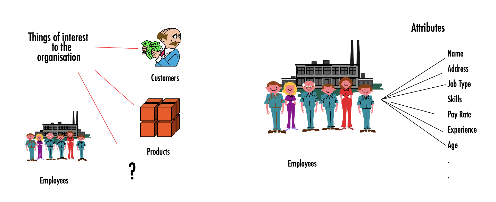 

--- 

# Big picture 

**Roles:** DB analysis, designers, developers, front-end app analysts and developers, DB admin

---

<!-- _class: plain -->

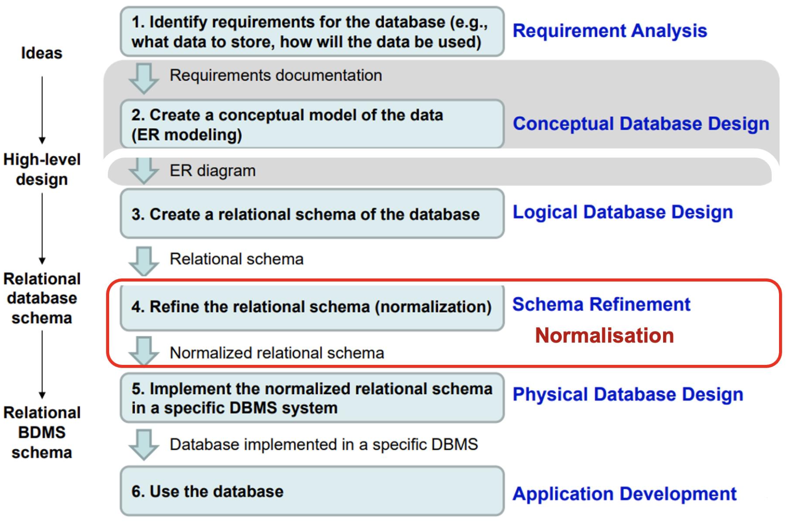

---

<!-- _class: section -->

# Data modelling using diagrams

--- 

# 1. Data modelling using diagrams 

Model _conceptual_ model in terms of entities, attributes, relationships using an **ER (Entity-Relationship) diagram**:

- Entity = rectangle with entity name at the top
- Attribute = in the entity rectangle, below the entity name, and with a type (e.g. integer, varchar, date)
- Relationship = link between entities (with optional label)

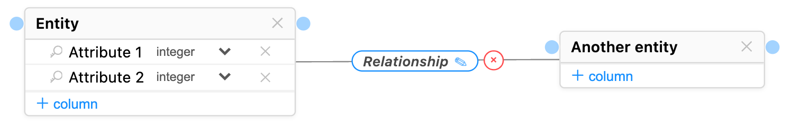

--- 

## Relationships ... 

- A relationship links one or more entities, and can have attributes (shown in a dash-linked rectangle)
- Relationships have **degree** and **cardinality**:
  - Degree: number of participating entity **types** in a relationship 
    - i.e. how many entities does the relationship link in the diagram (typically 2, sometimes 1)
  - Cardinality: number of  entity **instances** (next slide)

--- 

## Cardinality – number of _instances_ of entities 
 
 Left: one-to-one (e.g. bus and bus driver); Right: one-to-many (e.g. bus and passenger) 
 
 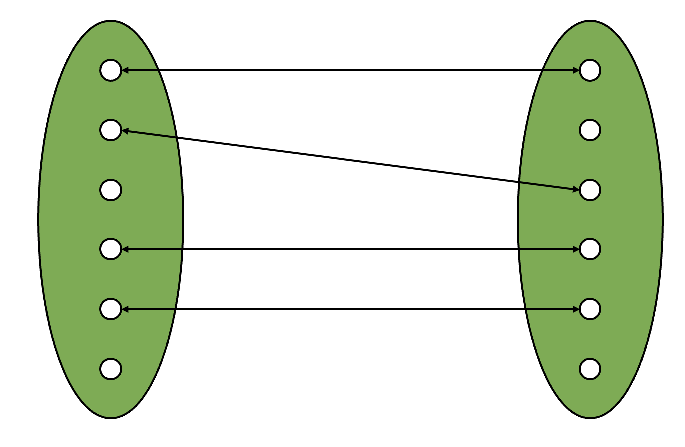 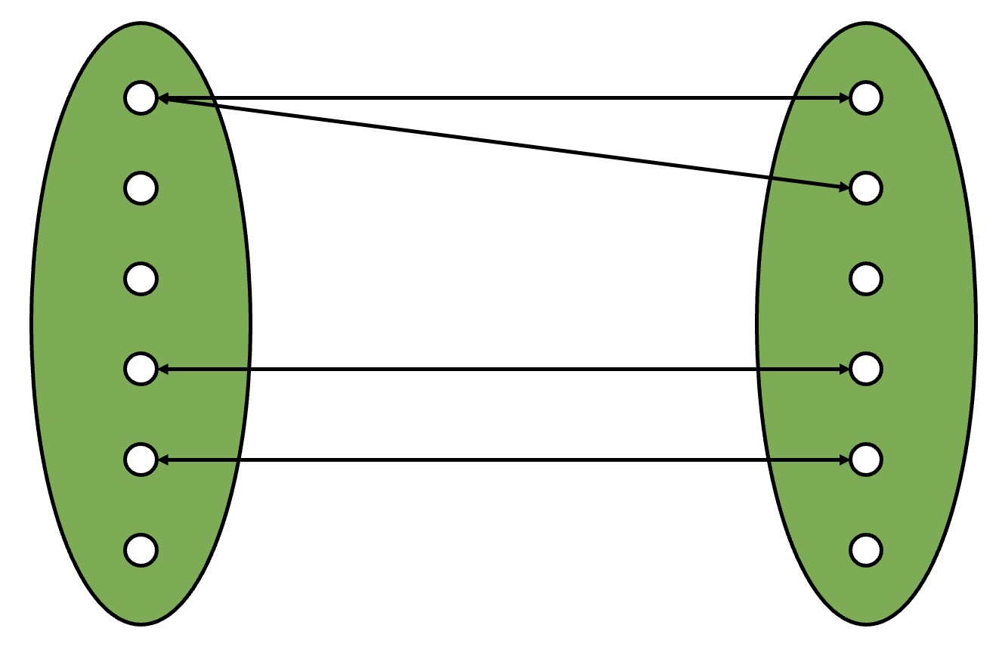
 
 ---
 
 
## Notation for cardinality 

_There are a number of different notations that can be used: pick one and be consistent!_

-  Chen: uses 1:1, 1:N, N:1, M:N labels 
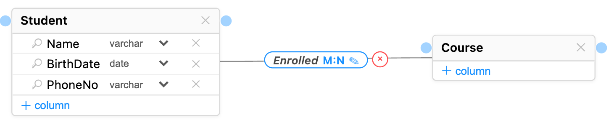

- UML: uses _low..high_ at each end of the relationship with `*`  indicating "many", so 1:N would be `1` at one end (short for `1..1`) and `0..*` at the other end

 --- 
 
## Notation for cardinality 

The Chen notation is simpler, but doesn't allow distinction between 0 (optional) and 1 (mandatory) to be modelled 

Example: a student must have at least one advisor

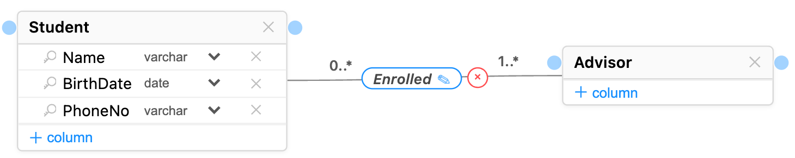

--- 

  ## Examples of degree and cardinality  (1/2)
  
- Enrolled is Binary degree: two entity types, student and course
- Enrolled is N-N cardinality: a student can enrol in many courses, and a course can have many students

--- 

  ## Examples of degree and cardinality  (2/2)

- MarriedTo is Unary degree: only one type of entity is involved: a Person
- MarriedTo is 1-1 cardinality: each individual person is married to one other person

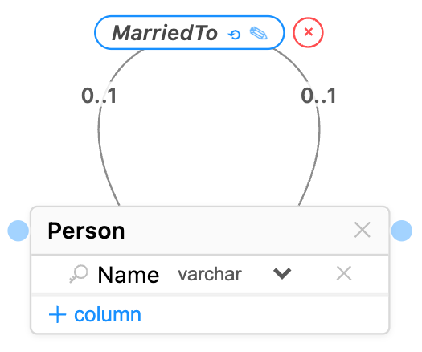

--- 

## Alternative notation for ER diagrams 

- Attribute: oval (with double line for multiple values, and dashed line for derived attributes [not shown below])
- Relationship: Diamond

> We won't be using this notation in this course

--- 

# Keys

- A **key** is one or more attributes that must be unique to each entity instance, i.e. no two instances can have the same value for their key attribute(s) (so e.g.  name is a bad choice)
  - A _super key_ is a set of attributes that can be a key
  - A _candidate key_ is a _minimal_ super key (no subset of it is a super key)
  - A _primary key_ is a chosen candidate key 
- Notation: key attribute indicated with key icon or PK
 
 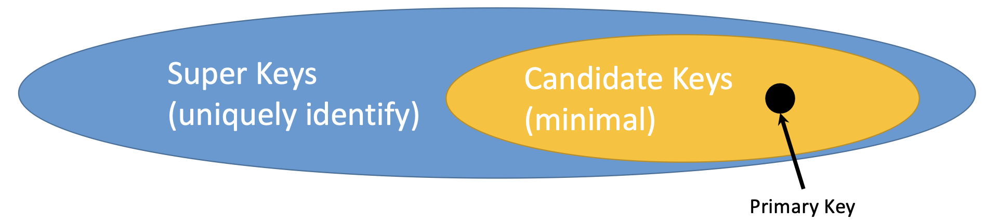
 
 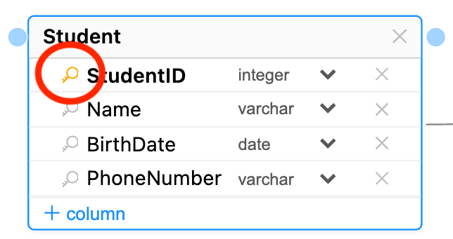

--- 

# Tips for modelling 

- Iterative!
- Need to focus on what is important, rather than capture everything 
- Careful with notation: link entities and associations with their attributes, an association needs to be linked to one or more entities
- Naming: 
  - Brief, but clear
  - Unique - e.g. don't use "name" for both "student name" and "employee name"
  - Entities and attributes: singular ("student")
  - Relationships: verbs or verb phrases ("inspects", "manages", "belongsTo")

---

<!-- _class: section -->

# Translating diagrams to relational databases

---

# 2. Translating diagrams to relational databases 

- Each entity becomes a table (relation) containing the entity's attributes
- Each relationship is mapped to either a table or additional attributes, depending on the cardinalities

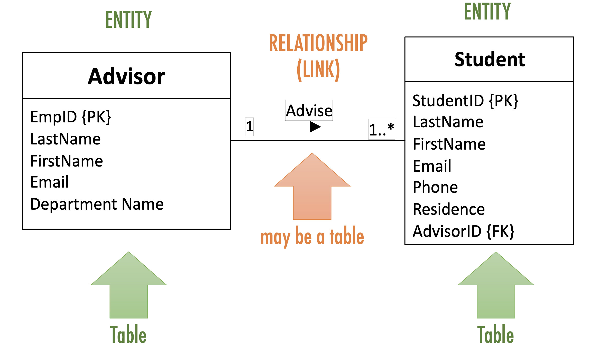

---

## Mapping a 1-N relationship as an additional attribute 

Advisor (left) is in a 1-N relationship ("Advise") with Student (right) 

Implement by adding to each student their advisor's ID (since there is at most 1)

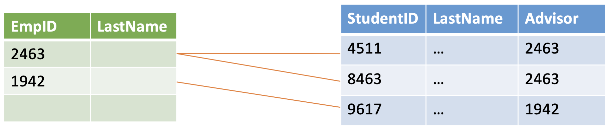

--- 

## Mapping an N-N relationship as a table 

Advisor (left) is in an N-N relationship ("Advise") with Student (right) 

Implement by creating a separate table for the relationship 

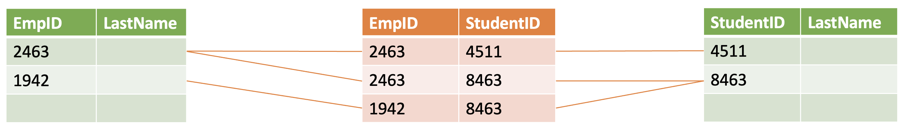

--- 

## Foreign keys 

- A _key_ is the attribute(s) that can be used to identify an entity instance (e.g. StudentID)
- Each table (relation) will have column(s) for its keys (e.g. the Student table has a column StudentID)
- A _foreign key_ is when a table has a column that contains keys for _another table_ (e.g. Student table contains the ID of the student's advisor)
  - in UML notation indicated with `{FK}`
  
 

---

<!-- _class: section -->

# Anomalies and Normalisation

--- 

# 3. Anomalies and Normalisation 

Errors or inconsistencies occurring when updating tables with redundant data:
- insertion anomaly example: require data about different entities to be entered at the same time in a single relation – cannot track customer address separately from order
- deletion anomaly example: deletion of a row results in loss of multiple facts –  deleting the last order loses the customer's contact details!
- modification anomaly example: need to modify multiple rows to update a fact consistently – update address requires updating every order

Example on the next slides.

--- 

<!-- _class: plain -->

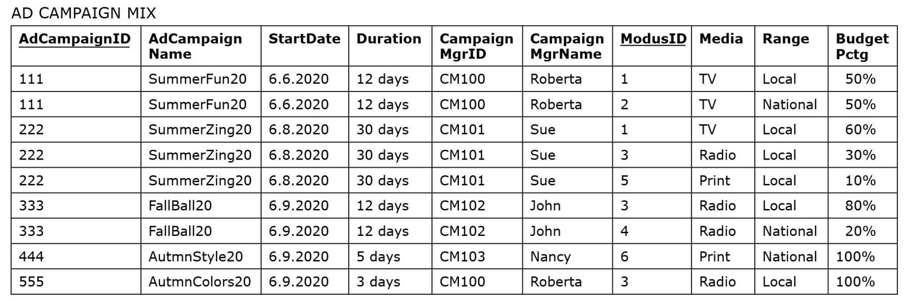

--- 

<!-- _class: plain -->

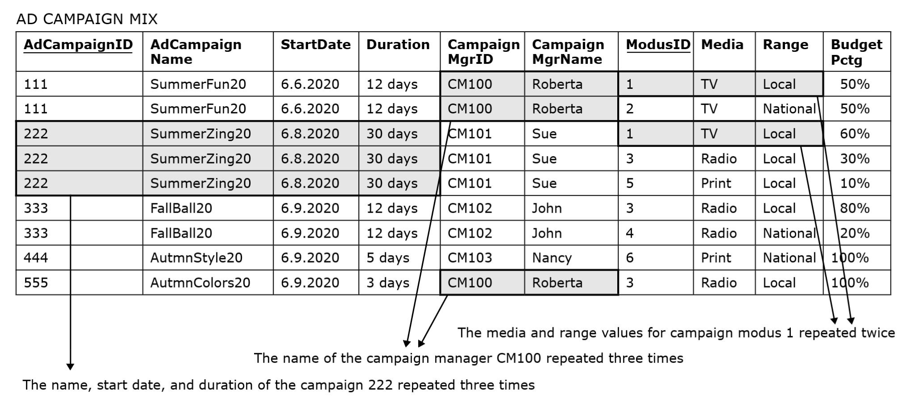

---

<!-- _class: plain -->

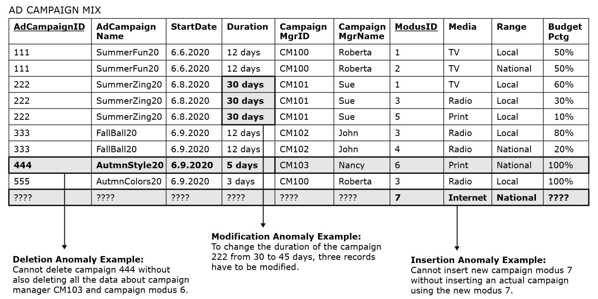

--- 

## Solution: _normalise_ by splitting up the table 

### How to do this? By analysing _functional dependencies_.

**Functional dependency** - occurs when the value of one (or more) column(s) in each record of a relation uniquely determines the value of another column in that same record of the relation

Example: ClientID → ClientName 

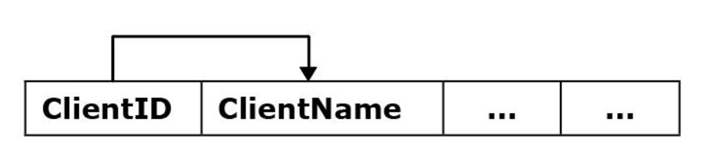

---

## Dependencies for the ad campaign DB

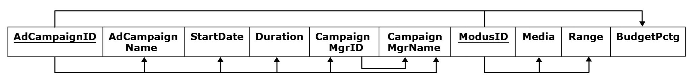

--- 

# Types of functional dependencies 

- ❌ **Partial**: a column depends on a *component* of a composite primary key; e.g. ModusID → Media, Range
- ✅ **Full**: the primary key functionally determines the column, and no separate component of it partially determines the same column
- ❌ **Transitive**: nonkey columns functionally determine other nonkey columns; e.g. CampaignMgrID → CampaignMgrName

--- 

## Dependencies for the ad campaign DB

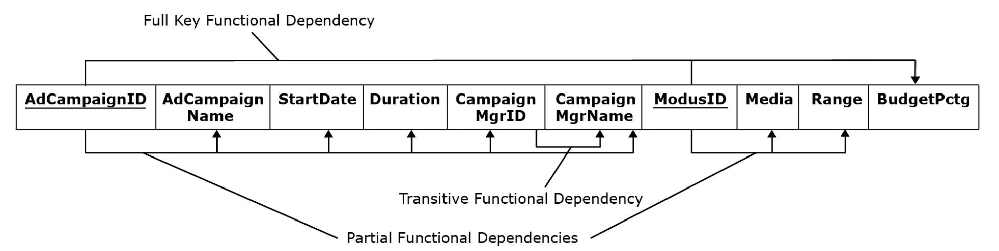

---

# Normalisation - 1NF

- First Normal Form (1NF): no multi-value entries  
- Normalise by splitting records

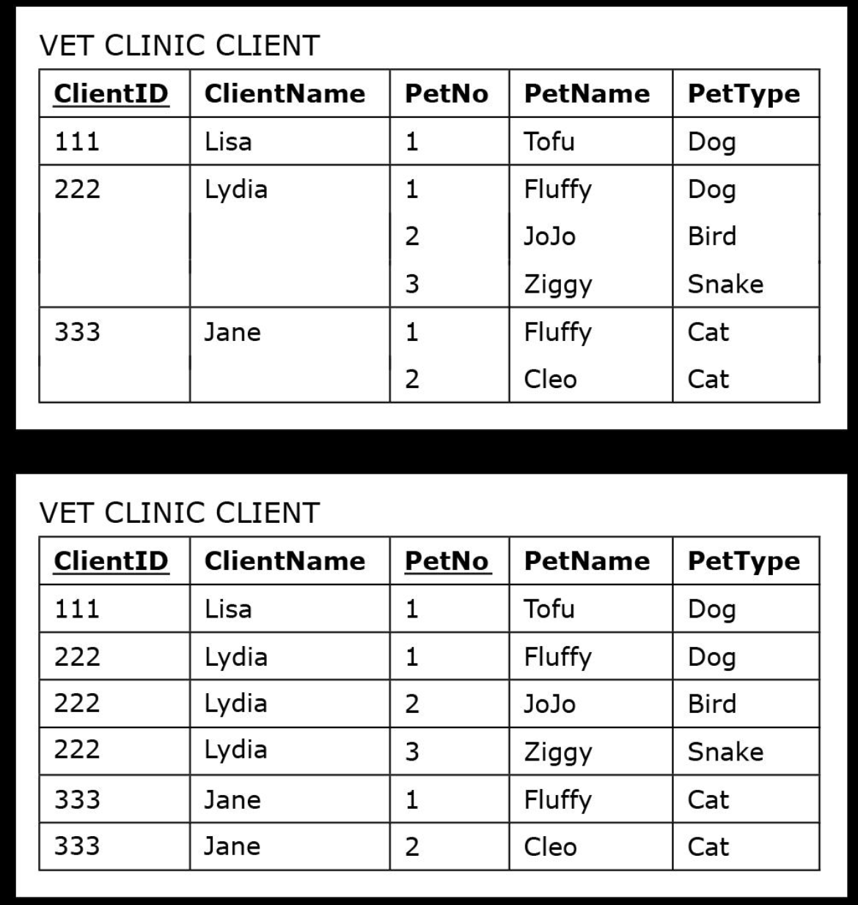

--- 

# Normalisation - 2NF

- Second Normal Form (2NF): a table is in 2NF if it is in 1NF and contains no **partial** functional dependencies — one way to ensure this is a single-column primary key
- Normalise by splitting out things that depend on part of the key into a separate table

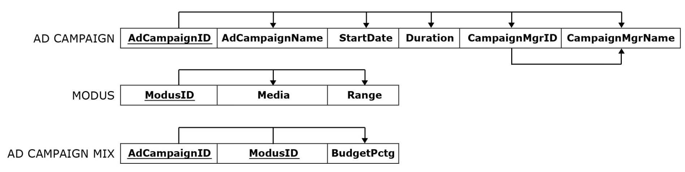

--- 

# Normalisation - 3NF

- Third Normal Form (3NF): A table is in 3NF if it is in 2NF and if it does not contain transitive functional dependencies
- Normalise by splitting out things that depend on nonkey columns into a separate table 

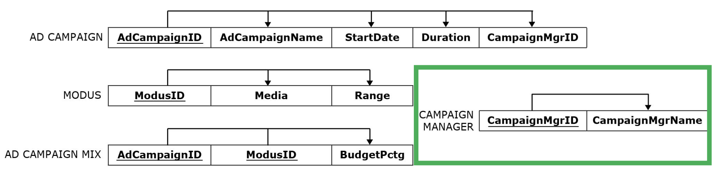

Result on the next slide.

---

<!-- _class: plain -->

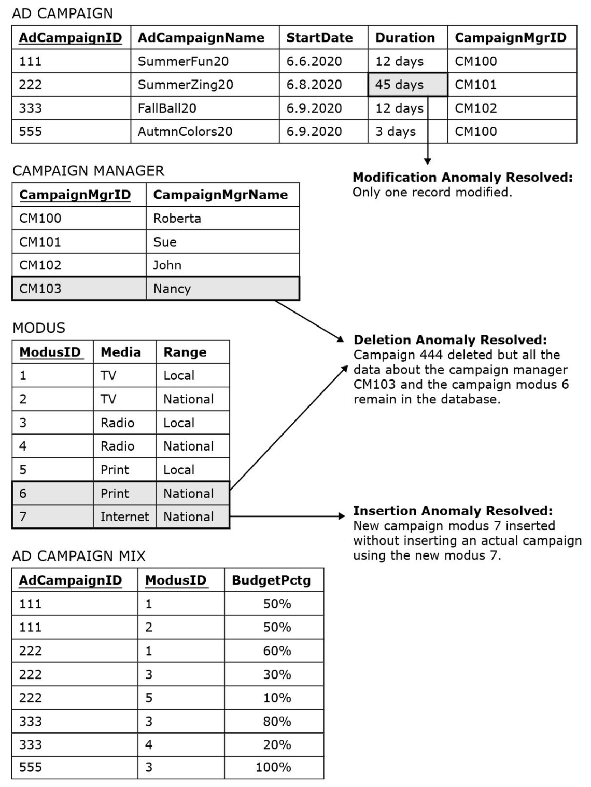

---

# Normalisation Summary 

- Having too many things (columns) in a table can cause anomalies when adding/deleting/changing records
- This occurs when there are partial or transitive functional dependencies 
- Solution is to normalise to 3NF:
    1. Identify functional dependencies 
    2. Split out columns to remove partial and transitive functional dependencies 

_This is probably the trickiest database concept we cover!_ 

Good news: typically a database that results from a design process (identifying entities, attributes, relationships) is in 3NF

--- 

# Today

1. Data modelling using ER diagrams
2. Translating diagrams to relational databases, and the role of *keys*
3. Anomalies, and avoiding them by *normalisation*

*Next: activities in part 2 today — learn by doing. 
Next week, building, modifying and querying relational databases with SQL 
("es-queue-el", or "sequel").*

--- 

<!-- _class: section -->

# Activities

---

# Activity — modelling your organisation 

*~20 minutes, in groups* Select one of the organisations below and then:

1. Identify some *entities* and *attributes* (not necessarily for all entities)
2. Identify at least one *relationship* 
3. Sketch an ER diagram showing the entities, attributes, and relationship(s) identified, as well as cardinalities 
4. Map your ER diagram to a collection of tables - which relationships are mapped to tables and which to additional attributes?

**Organisations:** the tax office (IRD), a large store (e.g. The Warehouse), VUW,
a local café.

---

# Activity — identify candidate keys 

*~10 minutes, in groups*

In the table below what would be possible choices for a primary key? Why?

  

---

# Activity — normalisation

*~20 minutes, in groups*

- Identify the dependencies in the table on the next slide — assume the
  primary key is Flight Number and Day.
- How would you transform it into 3NF? Identify functional dependencies,
  classify them, and split to remove partial and transitive dependencies.

Assumptions: a flight number always flies at the same time; a flight number does
not always use the same plane model. What else do you need to assume?

--- 

<!-- _class: plain -->

