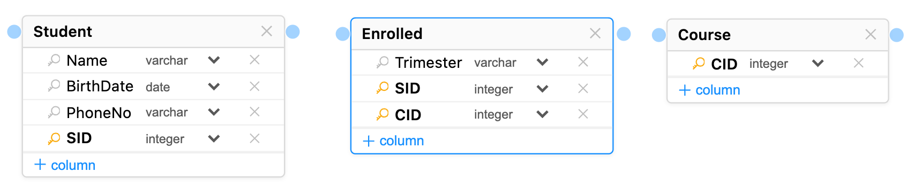
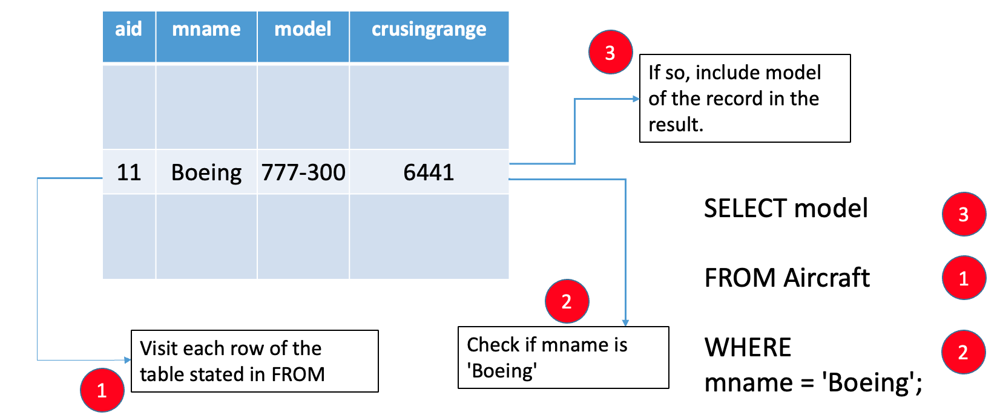
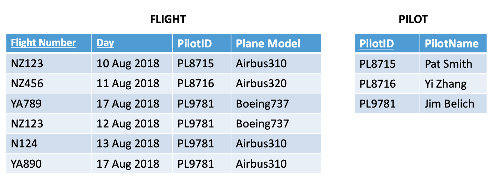
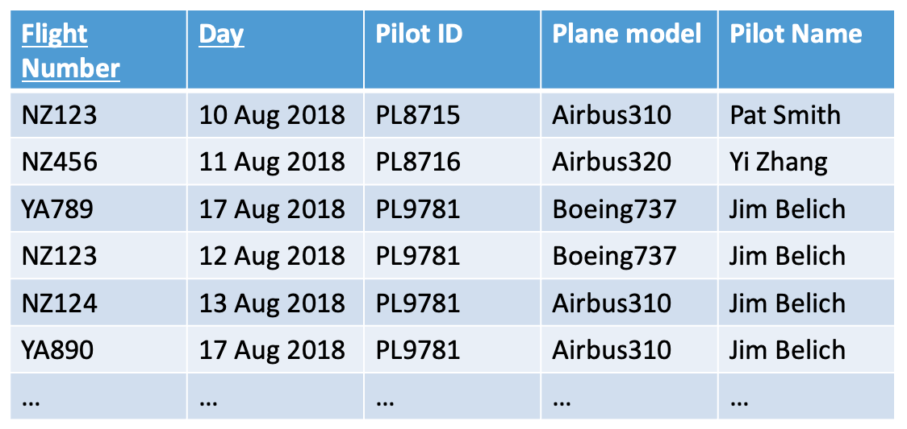
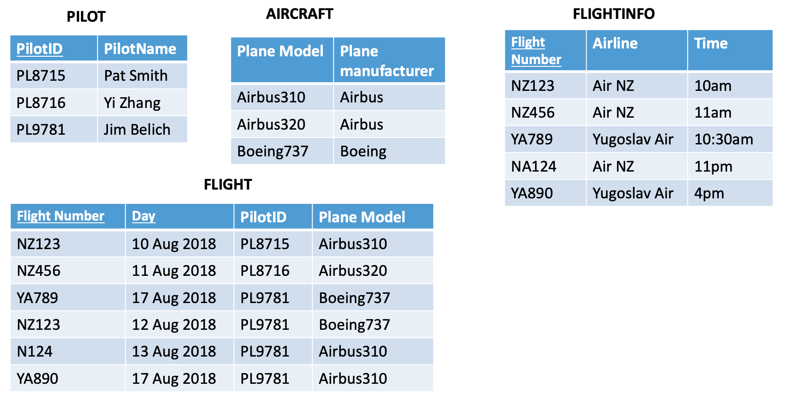
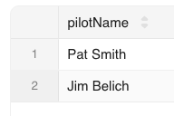
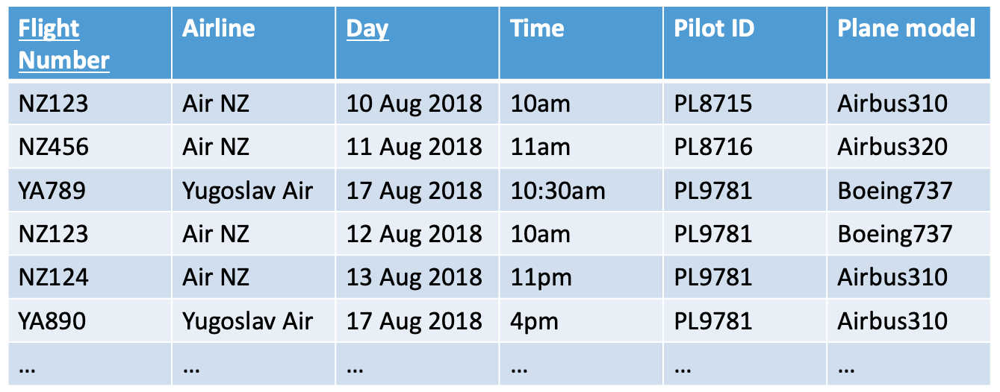

<!-- _class: title -->

# SQL

MBUA 512

---

<!-- _class: section -->

# Class 3 — SQL

_SQL = Structured Query Language, "es-queue-el" or "sequel". With Michael Winikoff._

Recap from last week (database design):

1. Data modelling using diagrams
2. Translating diagrams to relational databases, and the role of *keys*
3. Anomalies, and avoiding them by *normalisation*

_Based on slides by Professor Markus Luczak-Roesch._

---

## Class 2 review 

1. **Data modelling using diagrams:** ER diagrams showing entities with (_typed_) attributes and relationships (which can have attributes); _cardinalities_; _keys_.

2. **Translating diagrams to relational databases:** map entities to tables and relationships to tables or additional columns depending on cardinality; _foreign keys_

3. **Anomalies and normalisation:** remember 3 steps: identify dependencies; classify them (with respect to the key); normalise by breaking up table
  

---

## A simple data model ...


--- 

<!-- _class: plain -->

## A ***real*** data model (wikipedia)


<p class="credit"><a href="https://upload.wikimedia.org/wikipedia/commons/f/f7/MediaWiki_1.24.1_database_schema.svg">https://upload.wikimedia.org/wikipedia/commons/f/f7/MediaWiki_1.24.1_database_schema.svg</a></p>

---

<!-- _class: section -->

# SQL

--- 

# SQL commands 

- Data ***definition***: `CREATE TABLE` and `ALTER TABLE` - define the structure of a table (its _schema_) 
- Data ***manipulation***: `INSERT INTO` and `DELETE FROM` and `UPDATE` - change the data in the table  
- Data ***querying*** : `SELECT` 

(there are a lot more than these) 

> Important: make sure you select your own workspace (`user_[username]`)

--- 

# CREATE TABLE

```sql
CREATE TABLE name (
    column_name data_type, 
    column_name data_type, 
    ...
)
```

> Also can have _constraints_ ... 

---

# Data types 

<!-- - Boolean — `true` or `false` -->
- Integer / Int — `12`, `-14`
- Varchar(length) — a string, `'Hello!'` (variable-length characters; use single quotes)
- Real — `3.14`, `-9.8345` (floating point, inexact)
- Decimal — `3.29` (exact, up to 38 digits)
- Varbinary — binary data
- Date — `DATE '2026-12-31'` (year-month-day, with the optional word `DATE`)
- Time — `TIME '01:58:36.77'` (with the optional word `TIME`; also a time-with-time-zone)

--- 

# CREATE TABLE — example

```sql
CREATE TABLE people (
	personID INTEGER PRIMARY KEY,
	firstName VARCHAR(30) NOT NULL,
	lastName VARCHAR(30),
	birthdate DATE NOT NULL,
	planner INTEGER,
	email VARCHAR(30),
	FOREIGN KEY(planner) REFERENCES people(personID)
);
```

Constraints: PRIMARY KEY,  FOREIGN KEY,  NOT NULL

---

# ALTER TABLE

`ALTER TABLE` changes the definition of an existing table.

```sql
ALTER TABLE name ADD COLUMN column_name data_type
ALTER TABLE people ADD COLUMN prefName VARCHAR 

ALTER TABLE name DROP COLUMN column_name
ALTER TABLE people DROP COLUMN email -- loses data!

ALTER TABLE name RENAME COLUMN old_name to new_name
ALTER TABLE people RENAME COLUMN prefName to preferredName
```

---

# INSERT INTO

`INSERT INTO table_name (columns...) VALUES (vals...), ...`

**Single quotes** are for strings, **double quotes** for database objects.

```sql
INSERT INTO people VALUES
	(1, 'Bob', 'Smith', '1917-01-03', 1, NULL),
 	(2, 'Bob', 'Smith', '1973-03-25', NULL, 'bob@smith.net'),
	(3, 'Alice', 'Smith', '2026-07-07', 1, 'Alice@smith.net');
```

> the `(columns...)` is optional 

--- 

# Importing from a CSV 

*To generate rows from a CSV: ask an LLM, or use a spreadsheet with a few
formulae (next slide).*

> Prompt: "Convert the following CSV into an SQL statement to insert the data into an ANSI database"


---

# Using a spreadsheet

- use ` ="'" & A2 & "'" ` to convert each string cell into a quoted string
- use ` ="(" & TEXTJOIN(",",FALSE,D2:F2) & "), " ` to join cells into a single row
- put `INSERT INTO people VALUES ` in the first row
- copy and paste the rows

> See [separate short video](https://vstream.au.panopto.com/Panopto/Pages/Viewer.aspx?id=dbbd11a7-b20b-45a8-8571-b494016830f2&start=0) (in [class 3](https://nuku.wgtn.ac.nz/courses/34197/pages/class-3-week-4?module_item_id=1131062)) for demo

--- 

# DELETE FROM table

```sql
DELETE FROM table WHERE conditions
```

> Leaving out the WHERE deletes **all** rows!

--- 

# UPDATE 

```sql
UPDATE table_name
SET column1 = value1, column2 = value2, ...
WHERE condition;

UPDATE person SET email = 'bchen@vuw.ac.nz' WHERE personID=12

UPDATE staff SET salary = salary + 2000 WHERE salary<80000 
```

--- 

# SELECT

```sql
SELECT what
FROM   table(s)
WHERE  conditions

-- "--" starts a comment to the end of the line
/* and this is a 
  multi line comment */
  
SELECT *             -- "*" means "everything"
FROM   people
WHERE  email is NULL
```

By far the most complex SQL feature — covering basics today, more next week ... 

---

# How does SELECT work?



---

## What about multiple tables?

***What does this do?***

```sql
SELECT * FROM flight, pilot
```

Need to _join_ the tables using a ***join condition***


---

# Join condition

```sql
SELECT * FROM flight, pilot  WHERE flight.pilotID=pilot.pilotID
```



---

# Join condition - query result

```sql
SELECT * FROM flight, pilot  WHERE flight.pilotID=pilot.pilotID
```



---

# Join condition - 3 tables

```sql
SELECT DISTINCT pilotName  
FROM flight, pilot, aircraft
WHERE flight.pilotID=pilot.pilotID 
AND flight.planeModel=aircraft.planeModel
AND planeManufacturer='Airbus'
```





---


--- 

# Summary 

- `CREATE TABLE` and `ALTER TABLE` — define the structure of a table (its *schema*)
- `INSERT INTO`, `DELETE FROM`, `UPDATE` — change the data in the table
- `SELECT` — query data

*Next: activities in part 2 today — learn by doing. Next week, more SQL,
focusing on `SELECT`.*

---

<!-- _class: section -->

# Activities

--- 


# Activity — dependencies and keys 

*~15 minutes, in groups or individually*

1. Go to [learn.datascie.nz](https://learn.datascie.nz/) and login if needed
2. Click on `Workshops` (top menu), then select `Class 3` and click on `Open` for Q1 (Find Keys and FDs) [ignore Q2-Q6]
3. Explore the functional dependencies 
4. Identify two possible primary keys (i.e. _candidate keys_)

--- 


# Activity — normalisation

*~20 minutes, in groups or individually*

- Identify the dependencies in the table on the next slide — assume the
  primary key is Flight Number and Day.
- How would you transform it into 3NF? Identify functional dependencies,
  classify them, and split to remove partial and transitive dependencies.

Assumptions: a flight number always flies at the same time; a flight number does
not always use the same plane model. What else do you need to assume?


--- 

<!-- _class: plain -->



---


# Activity — SQL

*~25 minutes, individually or in groups*

1. Go to [learn.datascie.nz](https://learn.datascie.nz/) and login if needed
2. Select your own workspace (`user_[username]`)
3. Create the flight DB using [this file](https://bogdanstate.github.io/mbua512/dev/class-03/airline.txt) (i.e. open the file, copy the contents, and execute as an SQL query) [it's also in Nuku under [Class 3](https://nuku.wgtn.ac.nz/courses/34197/pages/class-3-week-4)]
4. Write a simple SELECT query to find all flight numbers flown by AirNZ (hint: use the flightinfo table)
5. Write a SELECT query to find all pilotIDs who fly for AirNZ (hint: combine the flight and flightinfo tables, building on your previous query)
6. Modify the previous query to find the _names_ of all pilots who fly for AirNZ (hint: join three tables - flight, flightinfo, and pilot)
