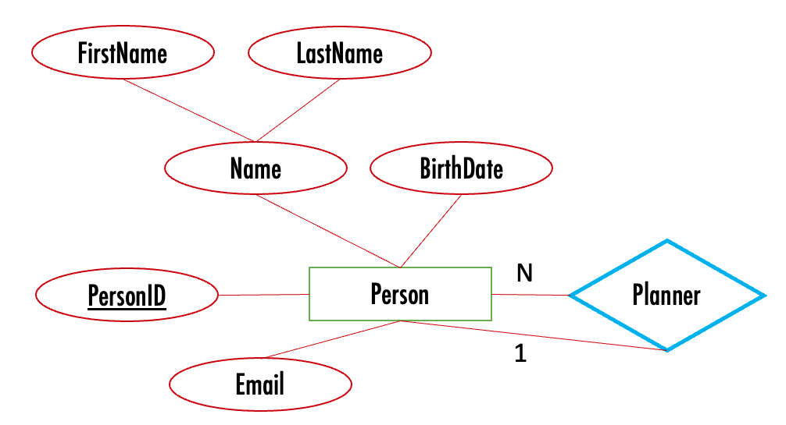

<!-- _class: title -->

# SQL

MBUA 512

---

<!-- _class: section -->

# Class 3 — SQL

_SQL = Structured Query Language, "es-queue-el" or "sequel". With Michael Winikoff._

Recap from last week (database design):

1. Data modelling using diagrams
2. Translating diagrams to relational databases, and the role of *keys*
3. Anomalies, and avoiding them by *normalisation*

_Based on slides by Professor Markus Luczak-Roesch._

---

# SQL commands 

- `CREATE TABLE` and `ALTER TABLE` - define the structure of a table (its _schema_)
- `INSERT INTO` and `DELETE FROM` and `UPDATE` - change the data in the table 
- `SELECT` - query data 

(there are a lot more than these) 

> Important: make sure you select `MySQL` (not `Trino`) and your own workspace (`user_[username]`)

--- 

# CREATE TABLE

```sql
CREATE TABLE name (
    column_name data_type, 
    column_name data_type, 
    ...
)
```


---

# Data types 

<!-- - Boolean — `true` or `false` -->
- Integer / Int — `12`, `-14`
- Varchar(length) — a string, `'Hello!'` (variable-length characters; use single quotes)
- Real — `3.14`, `-9.8345` (floating point, inexact)
- Decimal — `3.29` (exact, up to 38 digits)
- Varbinary — binary data
- Date — `DATE '2026-12-31'` (year-month-day, with the optional word `DATE`)
- Time — `TIME '01:58:36.77'` (with the optional word `TIME`; also a time-with-time-zone)

--- 

# CREATE TABLE — example (note KEY)

```sql
CREATE TABLE people (
	personID INTEGER PRIMARY KEY AUTOINCREMENT,
	firstName VARCHAR(30) NOT NULL,
	lastName VARCHAR(30),
	birthdate DATE NOT NULL,
	planner INTEGER,
	email VARCHAR(30),
	FOREIGN KEY(planner) REFERENCES people(personID)
);
```

---

# ALTER TABLE

`ALTER TABLE` changes the definition of an existing table.

```sql
ALTER TABLE name ADD COLUMN column_name data_type

ALTER TABLE countries ADD COLUMN continent VARCHAR
```

---

# INSERT INTO

`INSERT INTO table_name (columns...) VALUES (vals...), ...`

**Single quotes** are for strings, **double quotes** for database objects.

```sql
INSERT INTO people VALUES
	(1, 'Bob', 'Smith', '1917-01-03', 1, NULL),
 	(2, 'Bob', 'Smith', '1973-03-25', NULL, 'bob@smith.net'),
	(3, 'Alice', 'Smith', '2026-07-07', 1, 'Alice@smith.net');
```

> the `(columns...)` is optional 

--- 

# Importing from a CSV 

*To generate rows from a CSV: ask an LLM, or use a spreadsheet with a few
formulae (next slide).*

> Prompt: "Convert the following CSV into an SQL statement to insert the data into an ANSI database"

---

# Using a spreadsheet

- use ` ="'" & A2 & "'" ` to convert each string cell into a quoted string
- use ` ="(" & TEXTJOIN(",",FALSE,D2:F2) & "), " ` to join cells into a single row
- put `INSERT INTO people VALUES ` in the first row
- copy and paste the rows
- demo ... 

--- 

# DELETE FROM table

```sql
DELETE FROM table WHERE conditions
```

> Leaving out the WHERE deletes **all** rows!

--- 

# SELECT

```sql
SELECT what
FROM   table(s)
WHERE  conditions

-- "--" starts a comment to the end of the line
/* and this is a 
  multi line comment */
SELECT *             -- "*" means "everything"
FROM   people
WHERE  email is NULL
```

By far the most complex — basics today, more next week.

---

# How does SELECT work?


---

# SELECT with multiple tables — joins

```SELECT * FROM people p1, people p2```

Need a _join condition_

```SELECT p1.firstName AS birthday, p2.firstName as 'party planner' FROM people p1, people p2 WHERE p1.planner=p2.personID```


--- 

# Summary 

- `CREATE TABLE` and `ALTER TABLE` — define the structure of a table (its *schema*)
- `INSERT INTO`, `DELETE FROM`, `UPDATE` — change the data in the table
- `SELECT` — query data

*Next: activities in part 2 today — learn by doing. Next week, more SQL,
focusing on `SELECT`.*

---

# Class 4 — more SQL

- SELECT calculations (next slide) - and DISTINCT
- WHERE conditions (next next slide)
- ORDER BY (DESC)
- GROUP BY, and aggregates (min, max, avg, count, sum)
- LIMIT n

How to write SQL queries & tips

Other things(?): Transactions?

_(for now in the class 3 file - will separate out later)_

---

## SELECT calculations 

- string `||`
- AS
- numerical operations including floor, ceiling, round 
- date operations - including current date, subtraction

---

## WHERE conditions  

- IS NULL
- IN
- LIKE and `%_`
- numerical conditions 
- date conditions 
- logical operators (AND, OR, NOT)
- (not) EXISTS
- UNION, INTERSECT

---

# Running Example: birthday 

- Scenario: send a message to people on their birthday, and remind their designated party planner to plan a party earlier
- Data: name (first, last), birthdate, email address, and designated party planner  




---

# To create the database

```sql
DROP TABLE IF EXISTS  people;

CREATE TABLE people (
	personID INTEGER PRIMARY KEY AUTOINCREMENT,
	firstName VARCHAR(30) NOT NULL,
	lastName VARCHAR(30),
	birthdate DATE NOT NULL,
	planner INTEGER,
	email VARCHAR(30),
	FOREIGN KEY(planner) REFERENCES people(personID)
);
```

---

# To add data

```sql
INSERT INTO people VALUES
	(1, 'Bob', 'Smith', '1917-01-03', 1, NULL),
 	(2, 'Bob', 'Smith', '1973-03-25', NULL, 'bob@smith.net'),
	(3, 'Alice', 'Smith', '2026-07-07', 1, 'Alice@smith.net'),
	(4, 'sam', 'Smith', '2020-01-03', 1, 'sam'),
	(5, 'Bobbie','Smithton', '1987-03-16', NULL, 'bob@smith.net');
```

---

# Some queries to write (1/2)

1. Find people whose birthday is today so we can email them (combine first and last names)
2. Find people with a special birthday (e.g. 100) coming up (hint: need to calculate age, use FLOOR)
3. Find people with a birthday in January, February or March so we can email their planner (hint: use IN)

--- 

# Some queries to write (2/2)

administrative tasks:

4. Find people with missing or invalid email addresses (hint: use NULL AND ... NOT LIKE)
5. Find where two (or more) people have the same email address (hint: use EXISTS)
6. Find people who are not planners for anyone else and do not have a birthday (hint: use EXISTS)

analysis task:

7. how many people have a birthday in each month? (hint: use GROUP BY and EXTRACT(MONTH from ...))

--- 

# Tips for writing SQL

- Build it up in pieces, testing each piece (`*` can be useful)
- Think about:
  - What information you need to see in the result (which columns …) … values? Calculations? Aggregate calculations (e.g. SUM)?
  - What tables they come from
  - How you need to JOIN the tables
  - What constraints to use … and how to express them 
    - WHERE if based on row 
    - WHERE … AND exists – if not

---

# More tips

- `‘’` (single quotes), not `“` (double quote)
- Distinct – the whole row needs to be distinct, so sometimes select fewer columns
- Group By … Having … - the ”Having” goes just after the “Group By …”
- NULL is not the same as the empty string 
- Too many rows in result? Check JOIN conditions (or using “NATURAL JOIN” - which is not the same as “JOIN”)
- No rows in result? Check conditions, and perhaps remove some
- Using exists – make sure there is also an “AS …” (so can refer to parent query in sub-query)

---

# Summary 

---

<!-- _class: plain -->


<p class="credit">Source: https://siqian1992.blogspot.co.nz/</p>

---

# Some useful Superset commands (MOVE OR DELETE)

```sql
show schemas from idrive
show tables in idrive.relbench_rel_ratebeer   -- most tables
show tables in idrive.relbench_rel_avito
select * from idrive.relbench_rel_ratebeer.countries
```

Select schema `user_[username]`, replacing `[username]` with your username
(e.g. for me, `user_michaelwinikoff`).


--- 

<!-- _class: section -->

# Activities

--- 

## Some possible activities for class 3

- CREATE a DB 
- DB content: 
  - Add content - including from CSV?
  - Delete content 
  - Update content 
- Explore constraints 
- Simple (one table) SELECT
- Joins

---

## Some possible activities for class 4

- to complete

---


# Activity — ...

*~10 minutes, in groups*

