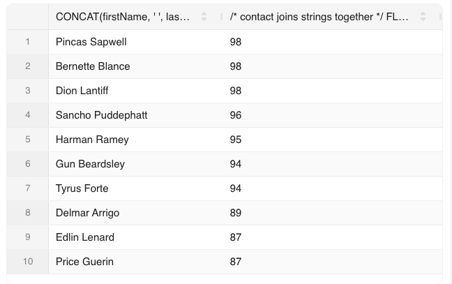
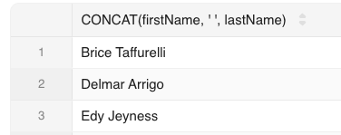
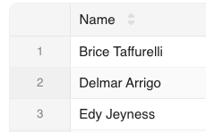
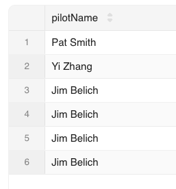
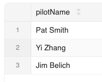

<!-- _class: title -->

# More SQL

MBUA 512

---


# Class 4 — More SQL

_SQL = Structured Query Language, "es-queue-el" or "sequel". With Michael Winikoff._

- SELECT calculations, ORDER BY (DESC), LIMIT n, named columns, DISTINCT
- WHERE conditions 
- GROUP BY, HAVING, and aggregates (min, max, avg, count, sum)

How to write SQL queries & tips

_Based on slides by Professor Markus Luczak-Roesch._

---

# Recap: SQL commands 

- `CREATE TABLE` and `ALTER TABLE` — define the structure of a table (its *schema*)
- `INSERT INTO`, `DELETE FROM`, `UPDATE` — change the data in the table
- `SELECT` — query data
(there are a lot more than these) 

> Important: make sure you select `MySQL` (not `Trino`) and your own workspace (`user_[username]`)

---

## SELECT calculations, ORDER BY, LIMIT

SELECT can include calculations:

```sql
SELECT concat(firstName, ' ', lastName), 
 floor(datediff(current_date,birthdate)/365)
FROM people WHERE birthdate IS NOT NULL
ORDER BY birthdate  -- add DESC for youngest
LIMIT 10; 
```

Explanation: `concat` joins strings, `current_date` is the current date, `datediff` gives the difference between two dates in days, `floor` rounds a number down. `EXTRACT(MONTH from d)` gets the month part of a date (not shown).



---

## SELECT named columns 

Can use `AS name` to give a column a name

```sql
SELECT concat(firstName, ' ', lastName) 
SELECT concat(firstName, ' ', lastName) AS Name
```

 

---

## SELECT DISTINCT 

- Just add `DISTINCT` to remove duplicates _rows_ from the result
- Example: select all pilots who have scheduled flights

```sql
select pilotName from flight, pilot where flight.pilotID=pilot.pilotID 
select DISTINCT pilotName from flight, pilot where flight.pilotID=pilot.pilotID
```
 


---

## WHERE conditions  

All sorts of things you can test as conditions in the WHERE part.

- IS NULL - is something NULL? (e.g. `email IS NULL`) - also IS NOT NULL.
- IN: `month IN (1,2,3)` - shorthand for `month=1 OR month=2 OR month=3`.
- LIKE:  is a string like a pattern, where `%` means "any string of characters" and `_` means any single character (e.g. `email LIKE '%@%.%'`).
- numerical conditions (< > = >= !=)
- date conditions (< = between): `d BETWEEN d1 AND d2`
- logical operators (AND, OR, NOT)
- (not) EXISTS (next slide)

---

## EXISTS 

- A WHERE condition is applied to each row on its own. But sometimes we need to check _other_ rows when deciding whether to include a given row
- Example: find all people who share a birthday: the condition for a row is whether someone _else_ (another row) has the same birthday.
- An EXISTS condition allows us to check a condition for a given row against more than just that row.

```sql
SELECT personID, firstName, lastName, birthdate FROM people p
WHERE EXISTS (select * from people p2 where p.birthdate=p2.birthdate AND p.personID != p2.personID);
```

Note use of names (`p1`, `p2`) to refer to row in the subquery. 


---

## UNION, INTERSECT

- These combine the results of queries. 
- UNION: include all rows from both queries 
- INTERSECT: include only rows that are in both results. Example: all pilots who fly both a Boeing and an Airbus (can't do this with a WHERE!)

```sql
(SELECT pilotName from flight, pilot, aircraft 
WHERE flight.pilotID=pilot.pilotID AND flight.planeModel=aircraft.planeModel
AND planeManufacturer='Airbus')
INTERSECT
(SELECT pilotName from flight, pilot, aircraft 
WHERE flight.pilotID=pilot.pilotID AND flight.planeModel=aircraft.planeModel
AND planeManufacturer='Boeing');
```

Note two join conditions, since we are joining 3 tables.

---

## GROUP BY, HAVING, aggregates

Aggregates (min, max, avg, count, sum) 

---

# Running Example: birthday 

- Scenario: send a message to people on their birthday, and remind their designated party planner to plan a party earlier
- Data: name (first, last), birthdate, email address, and designated party planner  


Use [this file](https://bogdanstate.github.io/mbua512/dev/class-04/birthday.txt) to create the database.

---

# Some queries to write (1/2)

1. Find people whose birthday is today so we can email them (combine first and last names)
2. Find people with a special birthday (e.g. 100) coming up (hint: need to calculate age, use FLOOR), order by closest birthday 
3. Find people with a birthday in August, September or October so we can email their planner (hint: use IN)

--- 

# Some queries to write (2/2)

Administrative tasks:

4. Find people with missing or invalid email addresses (hint: use IS NULL AND ... NOT LIKE)
5. Find where two (or more) people have the same email address (hint: use EXISTS)
6. Find people who are not planners for anyone else and do not have a birthday (hint: use EXISTS)

Analysis task:

7. how many people have a birthday in each month? (hint: use GROUP BY and EXTRACT(MONTH from ...))

--- 

# Tips for writing SQL

- Build it up in pieces, testing each piece (`*` can be useful)
- Think about:
  - What information you need to see in the result (which columns …) … values? Calculations? Aggregate calculations (e.g. SUM)?
  - What tables they come from, and how you need to JOIN the tables
  - What constraints to use … and how to express them 
    - WHERE if based on row 
    - WHERE … AND EXISTS – if not (or sometimes UNION, INTERSECT)

---

# More tips

- `''` (single quotes), not `"` (double quote)
- DISTINCT – the whole _row_ needs to be distinct, so sometimes select fewer columns
- GROUP BY … HAVING … - the ”HAVING” goes just after the “GROUP BY …”
- NULL is not the same as the empty string 
- Too many rows in result? Check JOIN conditions 
- No rows in result? Check conditions, and perhaps remove some
- Using EXISTS – make sure there is also an “AS …” (so can refer to parent query in sub-query)

--- 

<!-- _class: section -->

# Activities


---


## Activities — More SQL 

1. Go to [learn.datascie.nz](https://learn.datascie.nz/) and login if needed
2. Select `MySQL` (not `Trino`) and your own workspace (`user_[username]`)
3. If needed, create the flight DB using [this file](https://bogdanstate.github.io/mbua512/dev/class-03/airline.txt)

Write queries to answer the following questions 

TO COMPLETE 

--- 

# Activity — ...

*~10 minutes, in groups*

