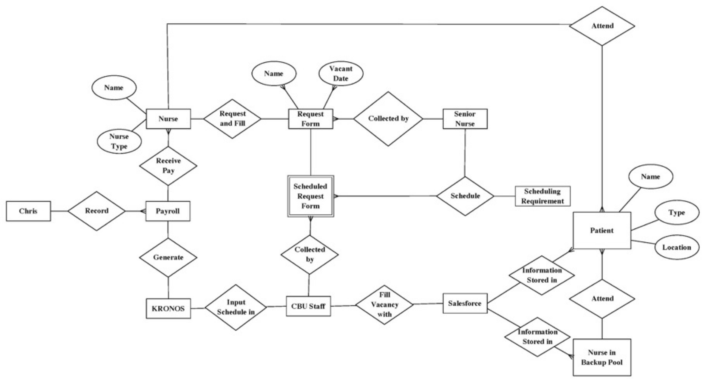

<!-- _class: title -->

# More SQL

MBUA 512

---


# Class 4 — More SQL

_SQL = Structured Query Language, "es-queue-el" or "sequel". With Michael Winikoff._

- SELECT calculations - and DISTINCT
- WHERE conditions 
- ORDER BY (DESC)
- GROUP BY, and aggregates (min, max, avg, count, sum)
- LIMIT n

How to write SQL queries & tips

Other things(?): Transactions?

_Based on slides by Professor Markus Luczak-Roesch._

---

# Recap: SQL commands 

- `CREATE TABLE` and `ALTER TABLE` — define the structure of a table (its *schema*)
- `INSERT INTO`, `DELETE FROM`, `UPDATE` — change the data in the table
- `SELECT` — query data
(there are a lot more than these) 

> Important: make sure you select `MySQL` (not `Trino`) and your own workspace (`user_[username]`)

---

## SELECT calculations 

- string `||`
- AS
- numerical operations including floor, ceiling, round 
- date operations - including current date, subtraction

---

## WHERE conditions  

- IS NULL
- IN
- LIKE and `%_`
- numerical conditions 
- date conditions 
- logical operators (AND, OR, NOT)
- (not) EXISTS
- UNION, INTERSECT

---

# Running Example: birthday 

- Scenario: send a message to people on their birthday, and remind their designated party planner to plan a party earlier
- Data: name (first, last), birthdate, email address, and designated party planner  


---

# To create the database

```sql
DROP TABLE IF EXISTS  people;

CREATE TABLE people (
	personID INTEGER PRIMARY KEY AUTOINCREMENT,
	firstName VARCHAR(30) NOT NULL,
	lastName VARCHAR(30),
	birthdate DATE NOT NULL,
	planner INTEGER,
	email VARCHAR(30),
	FOREIGN KEY(planner) REFERENCES people(personID)
);
```

---

# To add data

```sql
INSERT INTO people VALUES
	(1, 'Bob', 'Smith', '1917-01-03', 1, NULL),
 	(2, 'Bob', 'Smith', '1973-03-25', NULL, 'bob@smith.net'),
	(3, 'Alice', 'Smith', '2026-07-07', 1, 'Alice@smith.net'),
	(4, 'sam', 'Smith', '2020-01-03', 1, 'sam'),
	(5, 'Bobbie','Smithton', '1987-03-16', NULL, 'bob@smith.net');
```

---

# Some queries to write (1/2)

1. Find people whose birthday is today so we can email them (combine first and last names)
2. Find people with a special birthday (e.g. 100) coming up (hint: need to calculate age, use FLOOR)
3. Find people with a birthday in January, February or March so we can email their planner (hint: use IN)

--- 

# Some queries to write (2/2)

administrative tasks:

4. Find people with missing or invalid email addresses (hint: use NULL AND ... NOT LIKE)
5. Find where two (or more) people have the same email address (hint: use EXISTS)
6. Find people who are not planners for anyone else and do not have a birthday (hint: use EXISTS)

analysis task:

7. how many people have a birthday in each month? (hint: use GROUP BY and EXTRACT(MONTH from ...))

--- 

# Tips for writing SQL

- Build it up in pieces, testing each piece (`*` can be useful)
- Think about:
  - What information you need to see in the result (which columns …) … values? Calculations? Aggregate calculations (e.g. SUM)?
  - What tables they come from
  - How you need to JOIN the tables
  - What constraints to use … and how to express them 
    - WHERE if based on row 
    - WHERE … AND exists – if not

---

# More tips

- `‘’` (single quotes), not `“` (double quote)
- Distinct – the whole row needs to be distinct, so sometimes select fewer columns
- Group By … Having … - the ”Having” goes just after the “Group By …”
- NULL is not the same as the empty string 
- Too many rows in result? Check JOIN conditions (or using “NATURAL JOIN” - which is not the same as “JOIN”)
- No rows in result? Check conditions, and perhaps remove some
- Using exists – make sure there is also an “AS …” (so can refer to parent query in sub-query)

---

# Summary 

---

<!-- _class: plain -->


<p class="credit">Source: https://siqian1992.blogspot.co.nz/</p>

--- 

<!-- _class: section -->

# Activities


---


## Activities — More SQL 

1. Go to [superset.runs.nz](https://superset.runs.nz/) and login if needed
2. Select `MySQL` (not `Trino`) and your own workspace (`user_[username]`)
3. If needed, create the flight DB using [this file](https://bogdanstate.github.io/mbua512/dev/class-03/airline.txt)

Write queries to answer the following questions 

TO COMPLETE 

--- 

# Activity — ...

*~10 minutes, in groups*

