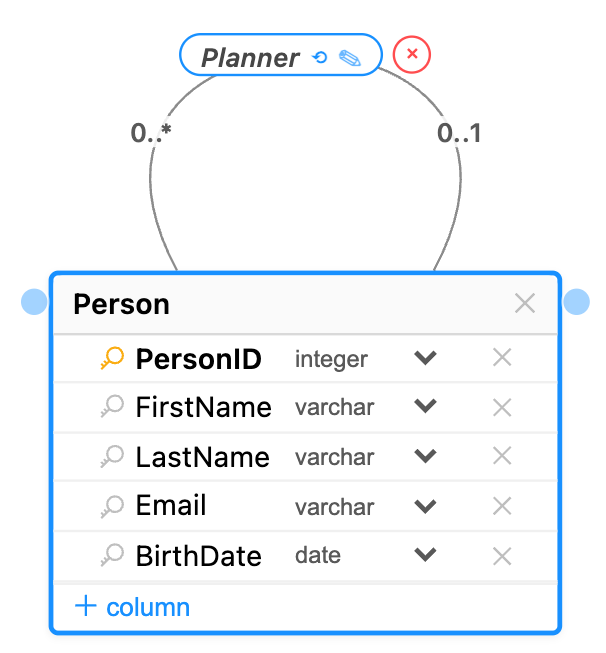
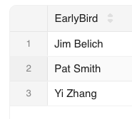
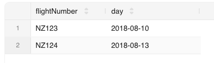

<!-- _class: title -->

# More SQL

MBUA 512

---


# Class 4 — More SQL

_SQL = Structured Query Language, "es-queue-el" or "sequel". With Michael Winikoff._

- SELECT calculations, ORDER BY (DESC), LIMIT n, named columns
- FROM - named tables 
- WHERE conditions - including EXISTS, INTERSECT/UNION
- GROUP BY, HAVING, and aggregates (min, max, avg, count, sum)

How to write SQL queries & tips

_Based on slides by Professor Markus Luczak-Roesch._

---

# Recap: SQL commands 

- `CREATE TABLE` and `ALTER TABLE` — define the structure of a table (its *schema*)
- `INSERT INTO`, `DELETE FROM`, `UPDATE` — change the data in the table
- `SELECT` — query data
(there are a lot more than these) 

> Important: make sure you select your own workspace (`user_[username]`)

---

# Running Example: birthday 

- Scenario: send a message to people on their birthday, and remind their designated party planner to plan a party earlier
- Data: name (first, last), birthdate, email address, and designated party planner  



Use [this file](https://bogdanstate.github.io/mbua512/dev/class-04/person.sql) to create the database.

> _Demonstrate writing queries - including recovering from errors!_

---


## SELECT calculations, ORDER BY, LIMIT

SELECT can include calculations. 

Some useful constructs: 
- `concat` joins strings
- `current_date` is the current date
- `datediff` gives the difference between two dates in days
- `floor` rounds a number down, `ceiling` rounds up, and `round` rounds to the nearest whole number
- `EXTRACT(MONTH from d)` gets the month part of a date.

**Query to write:** Find people whose birthday is today so we can email them (combine first and last names, show their age, order by age)

---

## SELECT named columns 

Can use `AS name` to give a column a name

```sql
SELECT firstName FROM people
SELECT firstName AS Name FROM people
```

> Use quotes if the name has spaces, e.g. `AS 'Birthday person' `

---

## FROM - named tables 

Can use `tablename alias` to refer to the table using `alias` (e.g. `person p1`)

This is useful for EXISTS (coming up)

---

## WHERE conditions  

All sorts of things you can test as conditions in the WHERE part.

- IS NULL - is something NULL? (e.g. `email IS NULL`) - also IS NOT NULL.
- IN: `month IN (1,2,3)` - shorthand for `month=1 OR month=2 OR month=3`.
- LIKE:  is a string like a pattern, where `%` means "any string of characters" and `_` means any single character (e.g. `email LIKE '%@%.%'`).
- numerical conditions (< > = >= !=)
- date conditions (< = between): `d BETWEEN d1 AND d2`
- logical operators (AND, OR, NOT)
- (not) EXISTS (next next slide)

--- 

## Queries to write 

- Find people with a birthday in August, September or October so we can email their planner, order by month and day (hint: use IN)
- Find people with missing or invalid email addresses (hint: use IS NULL OR ... NOT LIKE)

---

## EXISTS 

- A WHERE condition is applied to each row on its own. But sometimes we need to check _other_ rows when deciding whether to include a given row
- An EXISTS condition allows us to check a condition for a given row against more than just that row.

> EXISTS is somewhat tricky to use ... 

---

## Queries to write - administrative tasks

- Find where two (or more) people have the same email address (hint: use EXISTS)
- Find people who are not planners for anyone else and do not have a birthday (hint: use EXISTS)

> Note use of names (`p1`, `p2`) to refer to row in the subquery. 

---

## UNION, INTERSECT

- These combine the results of queries. 
- UNION: include all rows from both queries 
- INTERSECT: include only rows that are in both results.

**Query to write:** use INTERSECT to find the peopleID of people who are have a planner and are themselves a planner for someone else. 

---

## GROUP BY, HAVING, aggregates

- ***Aggregates*** combine rows (min, max, avg, count, sum), by default all rows
- ***GROUP BY*** specifies which rows to combine
  - When grouping by something (e.g. day) include it in the output
  - WARNING: including a non-aggregate in the output other than what's used for grouping gives an arbitrary element
- ***HAVING*** filters out certain _groups_ (WHERE filters out _rows_)

**Query to write:** How many people have a birthday in each month? (hint: use GROUP BY and EXTRACT(MONTH from ...)). 

Variant: how many _adults_ have a birthday in each month?

--- 

# Tips for writing SQL

- Build it up in pieces, testing each piece (`*` can be useful)
- Think about:
  - What information you need to see in the result (which columns …) … values? Calculations? Aggregate calculations (e.g. SUM)?
  - What tables they come from, and how you need to JOIN the tables
  - What constraints to use … and how to express them 
    - WHERE if based on row 
    - WHERE … AND EXISTS – if not (or sometimes UNION, INTERSECT)

---

# More tips

- `''` (single quotes), not `"` (double quote)
- DISTINCT – the whole _row_ needs to be distinct, so sometimes select fewer columns
- GROUP BY … HAVING … - the ”HAVING” goes just after the “GROUP BY …”
- NULL is not the same as the empty string 
- Too many rows in result? Check JOIN conditions 
- No rows in result? Check conditions, and perhaps remove some
- Using EXISTS –  refer to parent query in sub-query and make sure a row doesn't match itself in the subquery 

--- 

# Course Updates 

- **Main assignment**: walk through on Nuku and note task 3 pending in learn.datascie.nz 
- **Next class**: test (please arrive on time); some additional material (TBC), and then a support workshop 
- **Test next week**: logistics; note multiple versions and ease
- **Next today: Activities** ... (_next slides_)

--- 

<!-- _class: section -->

# Activities


---


## Activities — More SQL  (1/4)

1. Go to [learn.datascie.nz](https://learn.datascie.nz/) and login if needed
2. Select your own workspace (`user_[username]`)
3. If needed, create the flight DB using [this file](https://bogdanstate.github.io/mbua512/dev/class-03/airline.txt)

Write queries to answer the following questions (next slides)

--- 

## Activities — More SQL (2/4)


4. Retrieve the names of pilots, ordered by the earliest flight that they fly (and, if the flight time is the same, ordered by name). The desired output is on this slide (note the column name):




> Hint: use ORDER BY, AS and DISTINCT

---

## Activities — More SQL (3/4)


5. Retrieve the flight numbers and days of flights in the first half of August 2018 (i.e. before the 16th) flown by plane models 310 or 320 (you can assume that there are no other models of the form 3n0, so can use LIKE to match against ` '%3_0' `)




---

## Activities — More SQL (4/4)

6. Find the IDs of all pilots who fly more than one flight on a given day - try doing this first using an aggregate and GROUP BY and HAVING, and then using EXISTS.  (hint: there is only one pilot who does this)


