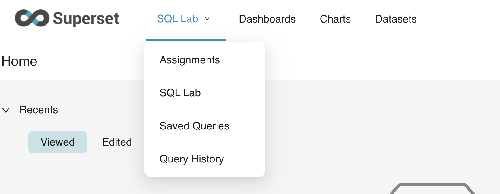

# Welcome to MBUA 512!
## 📊Data, Analytics & Insights💡
Michael Winikoff and Bogdan State

> This course provides databases and analytics knowledge for business analysts to function effectively. The databases component covers the fundamentals of relational databases, relational database modelling, and SQL database queries using enterprise database. The analytics component covers data extraction, visualisation and predictive analytics. 

_These slides are based on slides by Professor Markus Luczak-Roesch_

---

# Today ... 

1. Introductions 
2. How does MBUA 512 work?
3. AI use
4. What is data?
5. Database concepts
6. Introduction to the platform 

---

# 1. Introductions 

## Professor Michael Winikoff (michael.winikoff@vuw.ac.nz)

## Dr Bogdan State (bogdan.state@vuw.ac.nz)

---

# 2. How does MBUA 512 work?

## Learning objectives:
 
Students who pass this course will be able to:
1. Understand the key concepts in database management
2. Design and implement an effective database
3. Write and explain effective database queries
4. Apply and explain the use of analytics in solving business problems
5. Interpret analytics results for decision making

> This is technical - but designed to ***not*** assume prior knowledge. You can do this. 😃
---

# 2. How does MBUA 512 work?

## Activities: two-part classes from next week

- Part 1: 1240-130pm Fridays, GBLT1 - whole class (recorded and on Zoom)
- Part 2: 140-430pm - three streams (activities, not recorded)

Allocation to streams ... please complete survey (see announcement in Nuku) **by Tuesday 5pm**.

### ‼️ TODO: survey and announcement 


---

# 2. How does MBUA 512 work?

## Assessments

Each half of the course has **two small assignments** (10% each) and a **large assignment** (30%) 

_See Nuku for details and deadlines._ 

---

# Assessment policies 

* **All deadlines are hard**
* ... but extensions possible if you are affected by circumstances outside your control - contact me as soon as possible
* late submission penalty: 7% for each (part) day, up to 5 days
* Generative AI ... (next slides)

---

# 3. Generative AI use 

> Don't use it in a way that will affect your learning 

## Three Key principles:

1) Assistive use only, not a shortcut
2) Full transparency 
3) Own your work 

## Why? 

Generative AI is an ***amplifier***: need to have basic understanding to guide GenAI use and evaluate its outputs.

--- 

# 3. Generative AI use 

## AI and assessment: small assignments

* We strongly discourage any use of generative AI on these
* Why? These are small and easy tasks that require learning basic concepts
* Too easy to (unintentionally) over-rely on AI in a way that affects learning 
* ... which would affect your ability to complete the large assignment
* Note: if your submission contains clear signs of GenAI use you will receive a mark of 0 

--- 

# 3. Generative AI use 

## AI and assessment: large assignments 

* You are encouraged to use GenAI (consistent with the key principles)
* In order to ensure that you have not over-relied on GenAI there will be a closed-book test (on paper)
* This test will assess **basic** knowledge and is designed to be easy
* The test mark does not contribute to your final mark, but if you do not pass the test then you will be required to meet one of us to explain your work
* Failing the test and failing to adequately explain your work will result in a mark of 0 

--- 

# 4. What is data?


(image By Longlivetheux - Own work, CC BY-SA 4.0, https://commons.wikimedia.org/w/index.php?curid=37705247)

---

# 4. What is data? 

- A collection of *facts* (numbers, words, words, measurements, observations, descriptions)

## Types of data

- Qualitative/categorical 
- Quantitative/numerical
  - Discrete (e.g. 5)
  - Continuous (e.g. 5.2378)
  
- Structured
- Unstructured 

--- 

# 4. What is data? 

## Structured data

- Organised into tables or predefined formats.
- Examples: bank transactions, contacts lists, calendar, ...

---

# 4. What is data? 

## Unstructured data

- No predefined structure 
- Examples: photos, video, text messages, social media posts, ... 

---

# 4. What is data? Structured vs. Unstructured

* The type of the data affects what you can do with it, and how.
* Structured data is easier to analyse for insight
* But unstructured data can be richer  
* Some data has both (e.g. photos and audio have meta-data)


---

## What is data?  Activity 


Form small groups (2-4) and answer the following questions, considering the following scenario 
- What _structured_ data might the organisation have?
- What _unstructured_ data might the organisation have?
- What sort of insights might it be able to extract from each of these?

### ‼️ TODO: add scenario 

--- 

# What is data? Key Takeaways

- Structured = orderly and fast insights 
- Unstructured = messy but meaningful
- ***Both are valuable!***

---

# 5. Database concepts

_(from week 2)_

- terminology: data, information, database (entity, attribute), relationships
- DBMS - components (create, manipulate, maintain, front end apps)
- DB process: model, implement, deploy ...  **requirements** use conceptual DB model ER implemented logical model
- People/roles: DB analysis, designers, developers, front-end app analysts & developers, DB admin
- Relation (as table)

--- 

# 5. Database concepts (week 2 continued)

- DB modelling: ER modelling and diagram 
  - Entity, Attribute (single, composite, derived, multivalued, optional), Relationship (degree, cardinality - can have attributes)
  - mapping relationships to database tables ... additional attribute (1-N or 1-1) or table (N-N)
  - common mistakes, tips (naming)
  
---
  
# 5. Database concepts 
  
_(from week 3)_

- DB model: 
  - **relation** (unique name, order irrelevant, atomic values, unique rows)
  - **keys** (super key, candidate key, primary key ... foreign key)
  - integrity constraints 
  - **normalisation** (update and anomalies, functional dependencies, normal forms 1NF 2NF 3NF, normalisation)

---

# 6. Introduction to the platform 

---

# Activity: Access the platform 

1. Go to [http://github.com](http://github.com) 
2. Create an account (`sign up` top right) 
  - 👉you can use an existing Apple or Google account if you want
3. Go to [https://superset.runs.nz/](https://superset.runs.nz/) 
4. Login (login: `superset`, password: see Nuku) 
5. Click on `Sign in with Github` and follow the prompts

---

# Activity: Use the platform 

6. Point to `SQL Lab` (top left) and select `SQL Lab` from the drop-down (or just go to [https://superset.runs.nz/sqllab/](https://superset.runs.nz/sqllab/))


---

# Activity: Use the platform 

7. Ensure that the `schema` selected is `relbench_rel_hm`
8. Select `transactions` as the table schema - you should be able to see information on the table 
  - ❓it has 5 columns - what are they called?
9. Enter the SQL query below into the code area and click `Run`
  - ❓how many rows are returned by the query?
```
select * from transactions, article where transactions.article_id=article.article_id and transactions.price < 0.0003
```


--- 

# Activity: practice the assignment submission process 

1. In the platform point to `SQL Lab` and select `Assignments`

### ‼️ TODO: complete the instructions and set up a test assignment in Nuku


