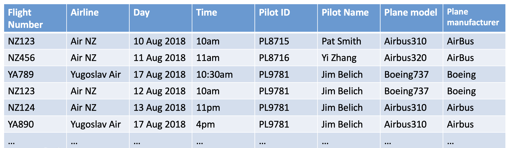
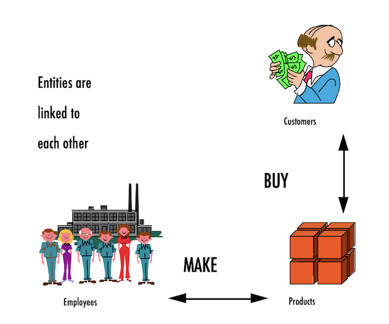

# Welcome to MBUA 512!
## 📊Data, Analytics & Insights💡
Michael Winikoff and Bogdan State

> This course provides databases and analytics knowledge for business analysts to function effectively. The databases component covers the fundamentals of relational databases, relational database modelling, and SQL database queries using enterprise database. The analytics component covers data extraction, visualisation and predictive analytics. 

_These slides are based on slides by Professor Markus Luczak-Roesch_

---

# Today ... 

1. Introductions 
2. How does MBUA 512 work?
3. AI use
4. What is data? And why is it important to BAs? ⏰ ⏰
5. Database concepts ⏰
6. Introduction to the platform ⏰

⏰ = activity 

---

# 1. Introductions - who are we?

1) Professor **Michael Winikoff** (michael.winikoff@vuw.ac.nz)

2) Dr **Bogdan State** (bogdan.state@vuw.ac.nz)

---

# 2. How does MBUA 512 work?

## Learning objectives:
 
Students who pass this course will be able to:
1. Understand the key concepts in database management
2. Design and implement an effective database
3. Write and explain effective database queries
4. Apply and explain the use of analytics in solving business problems
5. Interpret analytics results for decision making

> This is technical - but designed to ***not*** assume prior knowledge. You can do this. 😃

---

# 2. How does MBUA 512 work?

## Activities: two-part classes from next week

- Part 1: 1240-130pm Fridays, GBLT1 - whole class (recorded and on Zoom)
- Part 2: 140-430pm - three streams (activities, not recorded)

Allocation to streams: please complete survey **by Tuesday 5pm** (see Nuku announcement).

---

# 2. How does MBUA 512 work?

## Assessments

Each half of the course has **two small assignments** (10% each) and a **large assignment** (30%) 

- small assignments: develop skills & get feedback
- large assignments: demonstrate learning 

_See Nuku for details and deadlines._ 

---

# Assessment policies 

* **All deadlines are hard**
* ... but extensions possible if you are affected by circumstances outside your control - contact me as soon as possible
* late submission penalty: 7% for each (part) day, up to 5 days
* Generative AI ... (next slides)

---

# 3. Generative AI use 

> Don't use it in a way that will affect your learning 

## Why? 

Generative AI is an ***amplifier***: need to have basic understanding to guide GenAI use and evaluate its outputs.

## Three Key principles:

1) Assistive use only, not a shortcut
2) Full transparency 
3) Own your work 


--- 

# 3. Generative AI use: small assignments

* We **prohibit** any use of generative AI on these
* Why? These are small and easy tasks that require learning basic concepts
* Too easy to (unintentionally) over-rely on AI in a way that affects learning 
* ... which would affect your ability to complete the large assignment
* Note: if your submission contains clear signs of GenAI use you will receive a mark of 0 

--- 

# 3. Generative AI use: large assignments 

* You are encouraged to use GenAI (consistent with the key principles)
* In order to ensure that you have not over-relied on GenAI there will be a closed-book test (on paper) for each of the large assignments
* This test will assess **basic** knowledge and is designed to be easy
* The test mark does not contribute to your final mark, but if you do not pass the test then you will be required to meet one of us to explain your work
* Failing the test and failing to adequately explain your work will result in a mark of 0 

--- 

# Questions?

--- 

# 4. What is data?

A collection of *facts* (numbers, words, words, measurements, observations, descriptions)


(image By Longlivetheux - Own work, CC BY-SA 4.0, https://commons.wikimedia.org/w/index.php?curid=37705247)

---

# ⏰ Activity: data in organisations

Select one of the following organisations, form small groups (2-4 people) and answer the following questions:

1. What sorts of data would the organisation have?
2. What would happen if access to the data was lost?

**Organisations:** Tax office (IRD), a large store (e.g. The Warehouse), VUW, a local café (select one) 


---

# Types of data

- Qualitative/categorical 
- Quantitative/numerical -  Discrete (e.g. 5) vs. Continuous (e.g. 5.2378)
- Structured
- Unstructured 

--- 

# Structured data

- Organised into tables or predefined formats.
- Examples: bank transactions, contacts lists, calendar, ...

---

# Unstructured data

- No predefined structure 
- Examples: photos, video, text messages, social media posts, ... 

---

# Structured vs. Unstructured

* The type of the data affects what you can do with it, and how.
* Structured data is easier to analyse for insight
* But unstructured data can be richer  
* Some data has both (e.g. photos and audio have meta-data)


---

# ⏰ Activity: types of data in organisations


Form small groups (2-4) and answer the following questions, considering the same organisation you previously selected.

- What _structured_ data might the organisation have?
- What _unstructured_ data might the organisation have?
- What sort of insights might it be able to extract from each of these?

**Organisations:** Tax office (IRD), a large store (e.g. The Warehouse), VUW, a local café (select one) 


--- 

# What is data? Key Takeaways

- Structured = orderly and fast insights 
- Unstructured = messy but meaningful
- ***Both are valuable!***

---

# Why is data important to BAs?

- Information Systems include data as an essential component
- Business Analysts need to elicit and capture requirements that relate to data


--- 

# 5. Database concepts

Today will cover what is a **Database Management System**, what is a ***relational*** DB, what are: _entity_, _attributes_ and _relationships_

First two are about the _technology_, the last is about the concepts used to model data.

Next week will cover: 

1. Data modelling using diagrams
2. Translating diagrams to relational databases and the role of _keys_
3. Anomalies and avoiding them by _normalisation_ 

---

# Database Management System 

“A database management system (DBMS) is a software system that enables the use of a database approach.”

Functionality includes:

- Defining the structure of data
- Storing data 
- Checking for constraints 
- Querying data
- Managing data (e.g. security and access, concurrency control) 

---

# Relational Database

A database where data is stored as ***tables*** (technical term: "relations")



---

# Relations

- Named columns 
- Rows (each must be unique)
- _Note that the order of rows and of columns doesn't matter_

---

# Entities & Attributes


---


# Relationships 



---


# ⏰ Activity: data in organisations 

Form small groups (2-4) and answer the following question, considering the same organisation you previously selected.

Considering the _structured_ data that you identified earlier:

1. identify some _entities_
2. select an entity and identity some _attributes_
3. identify at least one _relationship_ 

**Organisations:** Tax office (IRD), a large store (e.g. The Warehouse), VUW, a local café (select one) 

---

# 6. Introduction to the platform 

---

# ⏰ Activity: Access the platform 

1. Go to [http://github.com](http://github.com) 
2. Create an account (`sign up` top right) 
  - 👉you can use an existing Apple or Google account if you want
3. Go to [https://superset.runs.nz/](https://superset.runs.nz/) 
4. Login (login: `superset`, password: see Nuku - don't share/post it!) 
5. Click on `Sign in with Github` and follow the prompts

---

# ⏰ Activity: Use the platform 

6. Point to `SQL Lab` (top left) and select `SQL Lab` from the drop-down (or just go to [https://superset.runs.nz/sqllab/](https://superset.runs.nz/sqllab/))


---

# ⏰ Activity: Use the platform 

7. Ensure that the `schema` selected is `relbench_rel_hm`
8. Select `transactions` as the table schema - you should be able to see information on the table 
  - ❓it has 5 columns - what are they called?
9. Enter the SQL query below into the code area and click `Run`
  - ❓how many rows are returned by the query?
```
select * from transactions, article where transactions.article_id=article.article_id and transactions.price < 0.0003
```

--- 

# ⏰ Activity: practice the assignment submission process 

10. In the platform point to `SQL Lab` and select `Assignments`

## NEED TO COMPLETE THIS SLIDE


